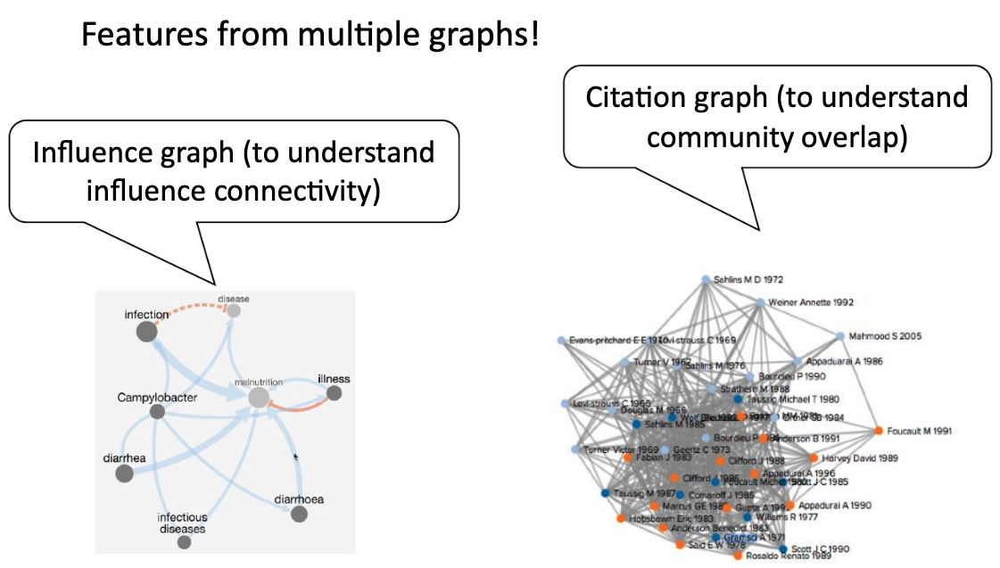
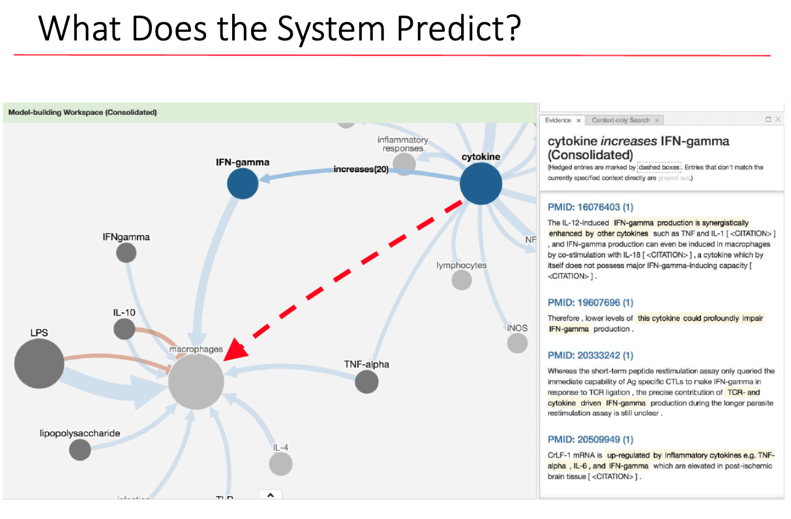

# [Scientific Discovery as Link Prediction in Influence and Citation Graphs](https://aclanthology.org/W18-1701/)
By Fan Luo, Marco A. Valenzuela-Escárcega, Gus Hahn-Powell, and Mihai Surdeanu ([Clulab](https://clulab.org/))

## Introduction
This repository contains the code and data used in the paper "Scientific Discovery as Link Prediction in Influence and Citation Graphs". The paper presents a novel approach to scientific discovery by treating it as a link prediction problem in influence and citation graphs.

&nbsp;&nbsp;&nbsp;&nbsp;&nbsp;&nbsp;&nbsp;&nbsp;&nbsp;&nbsp;&nbsp;&nbsp;&nbsp;&nbsp;&nbsp;&nbsp;

We introduce a machine learning approach for the identification of "white spaces" in scientific knowledge. Our approach addresses this task as link prediction over a graph that contains over 2M influence statements such as "CTCF activates FOXA1", which were automatically extracted using open-domain machine reading. We model this prediction task using graph-based features extracted from the above influence graph, as well as from a citation graph that captures scientific communities. We evaluated the proposed approach through backtesting. Although the data is heavily unbalanced (50 times more negative examples than positives), our approach predicts which influence links will be discovered in the "near future" with a F1 score of 27 points, and a mean average precision of 68\%.

## Requirements
The code is written in Python and requires the following packages:

- Neo4j Cypher
- NumPy
- SciPy
- scikit-learn
- imbalanced-learn

## Data
- The data used in the experiments is included in the repository. It consists of a collection of scientific papers and their citation relationships.
- Our dataset is also avaible to download with this [link](https://arizona.app.box.com/folder/72298595101)
- If you have issue to set it up, you can use the raw data files:
  - *influences.csv* contains the list of the influence edges such as  `A increase B`, where A corresponds to column `:START_ID(Concept)` ,B correspondsto `column :END_ID(Concept)`.
    - The concept id can be mapped to text with *concepts.csv*.
    - Each edge has its id, which can be mapped to the sentences supported this influence relation by looking up *evidence.csv*.
  - In *evidence.csv*, the column `PMID:string` shows the unique identifier number of the paper where the supporting sentence extracted from. With the PMID, you can mapped to its publishing year with *pmid_year.csv*.
  - *citations.csv* contains all the citation relations between pairs of papers. 
     The two columns are papers' PMID. Paper of the first column cites the paper of the second column.
     

## Resource Available
- Influence search engine: http://influence.clulab.org/
- Neo4j is a good visulization tool to view our influence graph.
